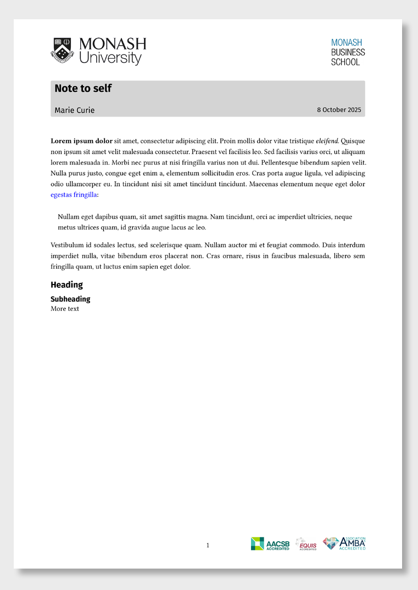

<!-- README.md is generated from README.qmd. Please edit that file -->

# Monash Memo Format Template

This is a Quarto template that assists you in creating a memo,
optionally with Monash University branding.

## Creating a new memo

You can use this as a template to create a memo. To do this, use the
following command:

``` bash
quarto use template numbats/monash-quarto-memo
```

This will install the extension and create an example qmd file that you
can use as a starting place for your memo.

## Installation for existing document

You may also use this format with an existing Quarto project or
document. From the quarto project or document directory, run the
following command to install this format:

``` bash
quarto install extension numbats/monash-quarto-memo
```

## Example

- [template.qmd](template.qmd)

<div>

[](examples/template.pdf)

</div>
